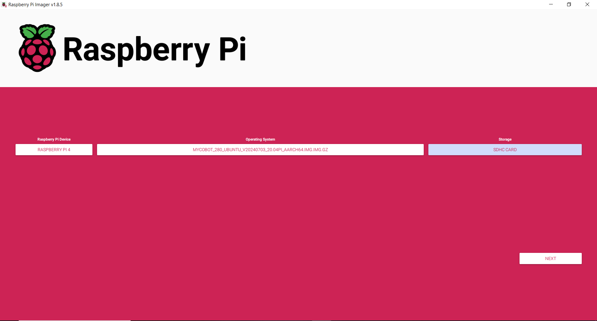

# setup_pi
If you are configuring many of the robot arms, you will need to setup our configurations. This includes broadcasting a wifi network automatically (setting up the raspberry pi in AP mode), installing docker, and pulling our docker image.

## Gather a Kit

Take an arm and ensure you have the full kit. This includes:
* G base
* clamp for G base
* power supply
* adaptor for power supply (US to UK)
* hdmi to mini hdmi cable
* lego connectors for gripper and for g base
* adaptive gripper
* extension cable for adaptive gripper
* usb wireless keyboard/mouse
* printed paper with grid markings for robot arm (this is in this repo [here](https://github.com/VModugno/MycobotProps))

If you are doing vision you will need:
* intel realsense  & cable
* mounting plate for intel realsense 405
* M3 screws

## Flash the SD Card

Before you assemble the robot, it's helpful to take out the SD card and flash it with the [Ubuntu 20.04 image](https://www.elephantrobotics.com/en/downloads/) from elephant robotics. This is because it's a pain to take out once assembled. To get it out, jiggle it from side to side with your thumb nail as you move it out.

The reason we use Ubuntu 20.04, instead of the default 18.04, is because there were intermittentent network issues with ROS2 on the old Ubuntu that don't show up on the newer one.

We use Raspberry Pi Imager to flash it, selecting Raspberry Pi 4, selecting the zipped .img file that you've downloaded, selecting the microsd card, and then when asking if you want to change OS customizations settings don't do and select "No" (these come from elephant robotics).



## Assemble the Robot
Assemble the robot together. Start with the grid paper on the bottom. Put the mounting plate for the camera on top. Put the G base on top, aligning to markings on grid paper.

From here, plug in the robot and power it on. You should see it boot on your monitor.

## Setup the Software on the Pi

You will probably want to change the resolution of the raspberry pi 4. To do this go to the search bar in the top left and search for `display` and then change the resolution to 1920x1080p.

Then you will want to disconnect the current wifi by going to the top right wifi symbol, clicking it, then selecting disconnect. Then find the wifi network for the lab and connect to that for internet. Refresh the system time zone as well.

Git clone this repo, and run it with sudo. It takes the name of the wifi network, which we name after the robot number, and the password. Ask someone for the password we use. We don't need to use sudo as the Pi is configured to run sudo commands w/o a password. And if it wasn't it would probably prompt us. We use the `$USER` variable so running with `sudo` will probably break it.
```
cd ~
git clone https://github.com/VModugno/mycobot_communications/
cd mycobot_communications/setup_pi
bash setup_pi_2004.sh mycobot_23 my_wifi_pass
```

# testing
After we run the setup script, we should restart the pi to apply some of the changes (specifically user group rules). Then:

```
mycobot-up
source install/setup.bash
export ROS_DOMAIN_ID=10
ros2 launch mycobot_interface_2 mycobot_comms_launch.py use_realsense:=True
```

From here on your client computer connect to the robot's wifi network, then test that the inverse kinematics demo works. You will need the RoboEnv ROS2 to do this, instructions [here](https://github.com/VModugno/RoboEnv/). Once you run the below commands. You should see the robot arm move and revolve around a point above the robot.
```bash
cd ~
git clone https://github.com/VModugno/mycobot_client/
cd mycobot_client
mamba activate roboenv2
colcon build
source install/setup.bash
export ROS_DOMAIN_ID=10
ros2 run mycobot_client_2 cobot_ik_demo
```

From here we will test that the realsense camera works. Run the below command to bring up rviz2. Then add the color camera topic through the gui, selecting color camera. Then edit the frame to be camera_link. Then ensure you see an image.
```bash
rviz2
```